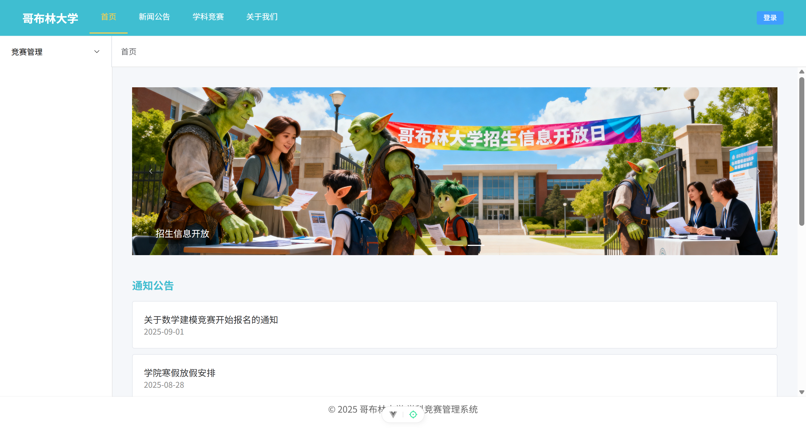

<p align="center"></p>

<h1 align="center">GoblinCave CMS Frontend</h1>

<p align="center">教育・競技向けのフロントエンド。Vue 3 + Vite + Pinia + Element Plus を採用し、セッションログイン、ロール認可、管理画面、リッチテキスト投稿などを提供します。</p>

<p align="center">
  <a href="https://vuejs.org/"></a>
  <a href="https://vitejs.dev/"></a>
  <a href="https://pinia.vuejs.org/"></a>
  <a href="https://element-plus.org/"></a>
  
</p>

<p align="center"></p>

- 日本語 | [简体中文](README.md)

## 目次
- [概要](#概要)
- [特徴](#特徴)
- [クイックスタート](#クイックスタート)
- [機能ナビ](#機能ナビ)
- [設定](#設定)
- [プロジェクト構成](#プロジェクト構成)
- [ドキュメントと協業](#ドキュメントと協業)
- [コントリビューション](#コントリビューション)

## 概要
- リポジトリのルートがアプリのルートです（src/public/index.html など）
- 技術スタック：Vue 3 + Vite + Pinia + Vue Router + Element Plus
- セッションモデル：Cookie/Session ベース（axios withCredentials 有効）

## 特徴
- 学生/管理者のロール管理とルーティング認可（meta.requiresAuth + meta.role）
- ログイン/登録のバリデーション（ユーザー名 ≥4・空白/記号不可、パスワード ≥8、登録は二重入力一致）
- 管理画面：ユーザー管理、システム設定（サンプル）、競技問題のリッチテキスト投稿
- 学生向け：競技参加/チーム、募集掲示、簡易チャット（サンプル）
- 初回ナビゲーション時にセッションを自動同期（リロード対策）

## クイックスタート
要件：
- Node.js: ^20.19.0 または >=22.12.0
- npm

実行：
```powershell
npm install
npm run dev
npm run build
npm run preview
npm run test:unit
```

## 機能ナビ
| モジュール/ページ | ルート | ロール | 要点 |
| --- | --- | --- | --- |
| ログイン/登録 | /login | 公開 | ユーザー名/パスワード/ロール（学生=0/管理者=1）、バリデーション |
| セッション | - | ログイン後 | 初回ナビでセッション同期、/user/logout でログアウト |
| 認可 | - | - | meta.requiresAuth + meta.role（'student' | 'admin'） |
| ホーム | / | 任意 | ポータル |
| ニュース | /news | 任意 | お知らせ表示 |
| コース | /courses | student | 学生用ページ |
| プロファイル | /profile | ログイン | 個人情報 |
| ユーザー管理（管理） | /admin/users | admin | 一覧・検索・CRUD（サンプル） |
| システム設定（管理） | /admin/settings | admin | 設定（サンプル） |
| 競技投稿（管理） | /admin/publish | admin | リッチテキスト投稿（サンプル） |
| 競技一覧 | /competitions | ログイン | 一覧 |
| 競技詳細 | /competitions/:id | ログイン | 学生：参加/チーム、管理者：管理 |
| マイ競技 | /my-competitions | student | 学生マイページ |
| 募集 | /seek | ログイン | 募集掲示（サンプル） |
| チャット | /chat | ログイン | 簡易チャット（サンプル） |

## 設定
- バックエンド API：`.env.*` の `VITE_API_BASE`（既定 `http://localhost:8080`）
- CORS：サーバー側でオリジン許可 + `allowCredentials=true`

## プロジェクト構成
```
.
├─ package.json
├─ README.ja.md
├─ README.md
├─ src/
├─ public/
├─ index.html
└─ vite.config.js
```

## ドキュメントと協業
- プロジェクト概要（機能 & TODO）：docs/overview.md
- 管理画面のフィールド/操作：docs/backend/admin-pages.md
- ユーザー API 仕様：docs/apis/user.md
- 画像ルール：docs/images/README.md

## コントリビューション
- 参加方法とルールは [CONTRIBUTING.md](CONTRIBUTING.md) を参照してください。
