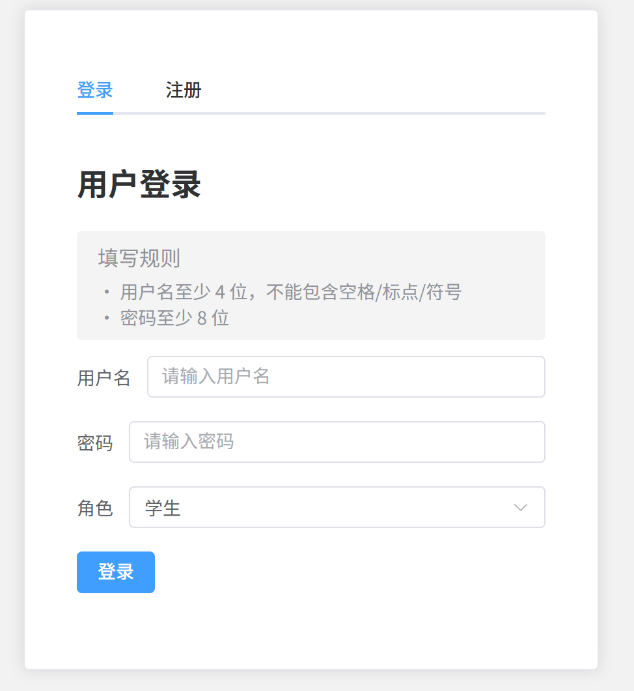
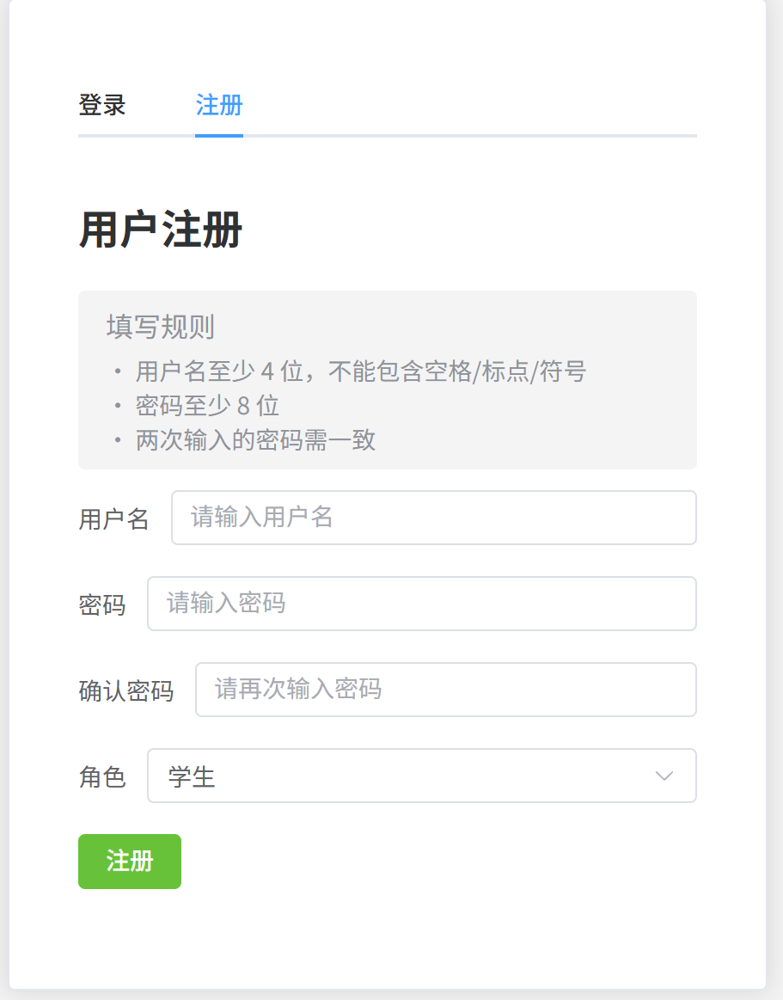
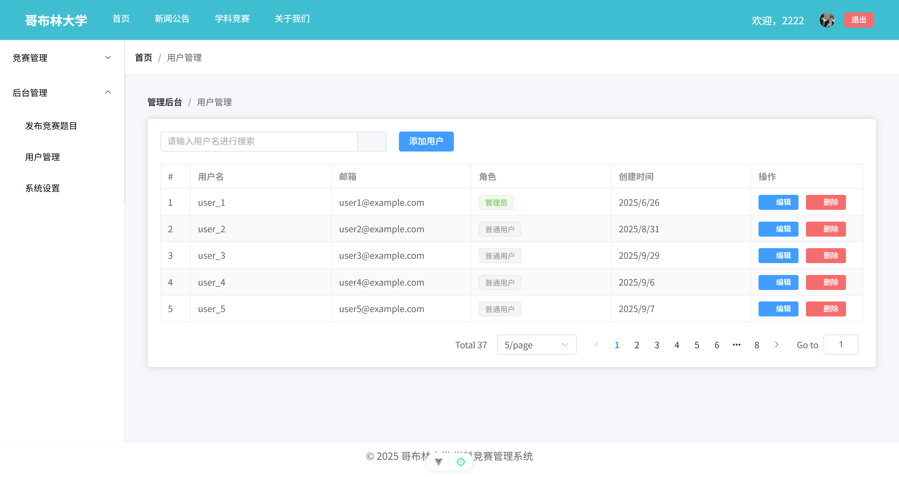
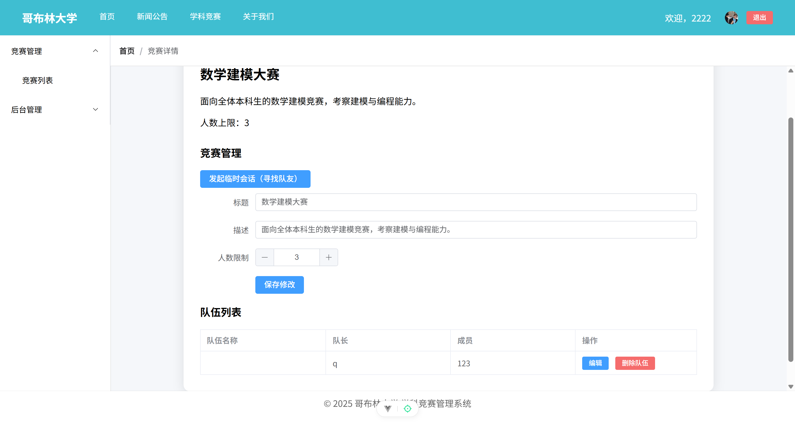

<p align="center">
  
</p>

<h1 align="center">GCS</h1>

<p align="center">GCS 的意思是 GoblinCaveSystem
<p align="center">本项目是 GoblinCaveSystem 的前端，又称 GCCS（GoblinCaveCompetitionSystem）<p>


<p align="center">高性能的前后端分离教学/竞赛管理前端。基于 Vue 3 + Vite + Pinia + Element Plus，内置会话登录、角色鉴权、后台管理与富文本发布等能力。</p>

<p align="center">
  <a href="https://vuejs.org/"></a>
  <a href="https://vitejs.dev/"></a>
  <a href="https://pinia.vuejs.org/"></a>
  <a href="https://element-plus.org/"></a>
  
  
</p>

<p align="center">
  
</p>

- 简体中文 | [日本語](README.ja.md)

## 目录
- [概述](#概述)
- [特性](#特性)
- [快速上手](#快速上手)
- [功能导航](#功能导航)
- [配置说明](#配置说明)
- [项目结构](#项目结构)
- [文档与协作](#文档与协作)
- [贡献指南](#贡献指南)

## 概述
- 仓库根目录即为应用根目录
- 技术栈：Vue 3 + Vite + Pinia + Vue Router + Element Plus

## 特性
- 多角色管理（学生/管理员），路由级别权限控制（meta.requiresAuth + meta.role）
- 登录/注册表单校验（用户名≥4 且不含空格/标点/符号；密码≥8；注册二次一致）
- 后台管理：用户管理、系统设置（示例）、竞赛发布（富文本编辑）
- 学生侧：竞赛报名/队伍管理、寻找队友、临时会话（示例）
- 首次路由自动刷新会话态（避免刷新后状态丢失）

## 快速上手
环境要求：
- Node.js: ^20.19.0 或 >=22.12.0
- 包管理器：npm

安装与启动：
```powershell
# 1) 安装依赖
npm install

# 2) 本地开发
npm run dev

# 3) 生产构建
npm run build

# 4) 预览构建产物
npm run preview

# 5) 单元测试
npm run test:unit
```

## 功能导航

| 模块/页面 | 路由 | 角色要求 | 功能要点 |
| --- | --- | --- | --- |
| 登录/注册 | /login | 公开 | 用户名/密码输入；角色选择：学生(0)/管理员(1)；前端校验：用户名≥4且不含空格/标点/符号，密码≥8，注册需两次一致 |
| 会话管理 | - | 登录后 | 首次路由导航自动刷新会话态（fetchCurrentUser）；退出登录调用 /user/logout，基于 Cookie/Session |
| 角色与鉴权 | - | - | 路由守卫：meta.requiresAuth + meta.role（'student' | 'admin'）拦截未授权访问 |
| 首页 | / | 任意 | 门户首页 |
| 新闻公告 | /news | 任意 | 展示新闻/公告 |
| 课程管理 | /courses | student | 学生可访问的课程页 |
| 个人中心 | /profile | 登录 | 个人资料页 |
| 用户管理（后台） | /admin/users | admin | 管理员用户列表、增删改（当前示例为模拟数据） |
| 系统设置（后台） | /admin/settings | admin | 系统配置页（示例） |
| 发布竞赛（后台） | /admin/publish | admin | 竞赛题目发布（示例，富文本） |
| 学科竞赛 | /competitions | 登录 | 竞赛列表 |
| 竞赛详情 | /competitions/:id | 登录 | 学生视角：报名/队伍；管理员视角：管理队伍与竞赛信息 |
| 我的竞赛 | /my-competitions | student | 学生我的竞赛页 |
| 寻找队友 | /seek | 登录 | 招募帖/找队友（示例） |
| 临时会话 | /chat | 登录 | 简易会话（示例） |
| API 封装 | - | - | axios 全局配置于 src/api/http.js（withCredentials=true）；用户相关接口于 src/api/user.js，与后端 UserController 对齐 |

### 截图

- 登录/注册



- 说明：展示登录与注册两个 Tab，包含用户名/密码/角色选择（学生=0/管理员=1）与表单校验规则提示。
	- 用途：文档与 README 展示登录流程与表单校验效果。
	
- 后台用户管理



	- 说明：管理员视角的用户列表页，包含搜索、增删改操作的示例（当前为演示数据，后续可接入后端）。
	- 用途：演示后台管理模块的入口与主要操作。
	
- 竞赛详情


	
	- 说明：展示竞赛详情页面，学生视角（报名/组队）与管理员视角（队伍管理/信息编辑）的不同区块。
	- 用途：说明角色差异化渲染与核心业务流程。


## 配置说明
- 后端 API 地址：在根目录的 `.env.*` 中设置 `VITE_API_BASE`，默认 `http://localhost:8080`
- CORS：后端需允许来源并 `allowCredentials=true`，前端已启用 `withCredentials`

## 项目结构
```
.
├─ package.json           # 应用脚本与依赖
├─ README.md              # 当前文件
├─ src/                   # 源码（Vue、Pinia、Router、API 等）
├─ public/                # 静态资源
├─ index.html             # 入口 HTML
└─ vite.config.js         # Vite 配置
```

## 文档与协作
- 项目概览（功能 & TODO）：docs/overview.md  ← 团队协作首页
- 后台页面字段与操作说明：docs/backend/admin-pages.md
- 用户相关 API 约定：docs/apis/user.md
- 图片存放与引用规范：docs/images/README.md

## 贡献指南
请阅读根目录的 [CONTRIBUTING.md](CONTRIBUTING.md) 以了解分支策略、提交信息风格、代码规范与 PR 流程。