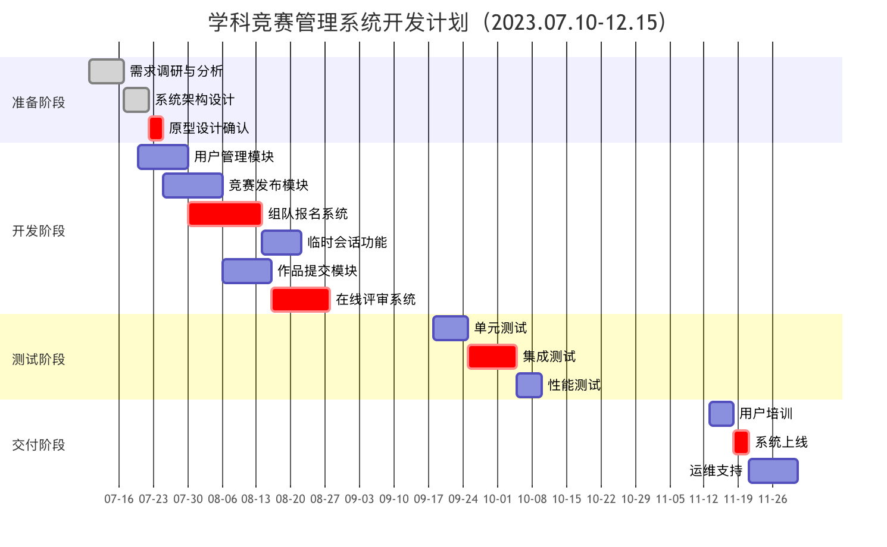

# **学科竞赛管理系统项目计划书**

## **一、项目目标与范围**

### **1. 项目目标与背景**

**全流程数字化**：实现竞赛从发布→报名→评审→归档的在线闭环管理。

**核心问题解决**：

​    报名信息标准化（减少人工核对时间）

​    组队匹配效率提升（支持跨专业标签化组队）

​    评审错误率降低（自动统分+多维评分）

​    构建永久性竞赛作品库（支持分类检索）

**项目背景：**当前高校学科竞赛活动蓬勃发展，但传统的人工管理模式已严重制约其发展效率：报名信息分散在微信、QQ、邮件和纸质表格等多种渠道，导致信息核对效率低下；跨专业组队缺乏有效对接平台；评审过程依赖纸质材料传递，评分统计错误率较高；更严重的是，大量的获奖作品赛后未能有效保存，造成优质学术资源的严重流失。为此，需建立一套全流程数字化管理系统，通过智能化的题目发布、精准组队匹配、在线评审和成果归档等功能，改变当前低效的管理模式。

### **2.开发范围**

| **包含模块**               | **不包含内容**     |
| -------------------------- | ------------------ |
| 题目发布与富文本编辑       | 移动端APP开发      |
| 在线报名与智能组队匹配     | 竞赛奖金发放系统   |
| 临时会话（文字/图片/文件） | 线下场地预约功能   |
| 作品在线提交               | 竞赛经费管理模块   |
| 多维度评审与自动统分       | 第三方支付接口对接 |
| 结果公示与作品展示库       | 人脸识别身份认证   |

## **二、项目团队与分工**

**项目经理：**（1人）负责全周期管控、风险管理、资源协调。

**前端开发工程师：**（1人）负责vue3框架开发。

**后端开发工程师：**（1人）负责Spring Boot API开发、数据库优化，MySQL架构设计、性能调优。

**测试工程师：**（1人）负责自动化测试用例编写、压力测试。

**UI设计师：**（1人）负责原型设计、交互优化。

**总计**：5人

## **三、关键里程碑与进度计划**

### 1.**项目里程碑**

| 里程碑                 | 日期     | 交付物                 |
| ---------------------- | -------- | ---------------------- |
| 需求确认与架构设计完成 | 7月21日  | 需求文档、设计文档     |
| 核心功能模块开发完成   | 9月15日  | 报名/组队/评审核心功能 |
| 系统集成与内部测试     | 10月20日 | 测试报告               |
| 系统上线               | 12月1日  | 部署文档               |
| 项目结项               | 12月15日 | 结项报告               |

### 2.**详细甘特图计划**

**准备阶段（7.10-7.21）**

- 需求分析（7.10-7.14）：
  - 与学生代表进行研讨会
  - 编写需求规格说明书
- 设计文档（7.17-7.21）：
  - 选择系统架构和相关模块以及实现技术（Vue3+Spring Boot+mysql）。
  - 绘制ER图与API文档，并编写项目设计文档。

**核心开发阶段（7.24-9.15）**

- 重点模块开发：
  - 富文本编辑器集成（8.1-8.5）
  - 临时会话系统（8.21-8.30）
  - 智能组队算法（9.1-9.8）
  - 评审功能模块（9.9-9.15）

**测试优化阶段（9.18-10.20）**

- 测试重点：
  - 评审流程测试
  - 文件上传处理测试
  - 临时会话测试
  - 组队功能测试

**交付阶段（11.13-12.15）**

## **四、风险评估与应对策略**

| **风险点**                 | **具体表现**                                                | **应对措施**                                                 |
| -------------------------- | ----------------------------------------------------------- | ------------------------------------------------------------ |
| **前后端数据交互格式冲突** | Vue Axios默认JSON格式与Spring Boot Jackson解析不匹配。      | 统一协议，空值策略：Spring Boot配置`spring.jackson.default-property-inclusion=non_null` |
| **MySQL并发事务锁冲突**    | 组队报名高峰时间大量SELECT阻塞写操作。                      | 通过监控工具对数据库的锁冲突和死锁进行实时监控，及时发现和解决问题。一旦发生锁冲突或死锁，需要及时记录相关信息，并对数据库的锁机制进行优化。 |
| **评审专家名单未按时提供** | 竞赛组委会未在评审开始前3天提交评委名单，导致权限分配失败。 | 动态权限管理，基于Spring Security授权。                      |
| **XSS跨站脚本攻击**        | 富文本编辑器插入恶意脚本污染其他用户页面。                  | 对用户输入进行HTML转义。在用户输入内容之前使用输入验证机制。使用内容安全策略（CSP）来限制执行的脚本来源。 |

## **五、资源需求**

### **1.硬件环境**

| **资源类型** | **配置要求** |
| ------------ | ------------ |
| 应用服务器   |              |
| 数据库服务器 |              |
| 文件存储     |              |

### **2.软件环境**

| **类别** | **技术栈**                        |
| -------- | --------------------------------- |
| 前端     | Vue3                              |
| 后端     | Spring Boot 3.0 + Spring Security |
| 数据库   | MySQL + Redis                     |
| 文件处理 | vue3+Spring boot                  |

### **3.第三方服务**

| **服务类型** | **用途**         | **推荐方案**                                                 |
| ------------ | ---------------- | ------------------------------------------------------------ |
| 富文本编辑器 | 题目发布内容编辑 | WangEditor V5                                                |
| PDF生成      | 电子证书导出     | 通过 html2canvas 将 HTML 页面转换成图片，然后再通过 jspdf 将图片的 base64生成为 pdf 文件。 |
| 实时通信     | 临时会话消息推送 | vue3                                                         |

## **六、交付物**

1. 可运行系统（Web端）
2. API接口文档
3. 项目需求规格说明书
4. 项目设计文档

 