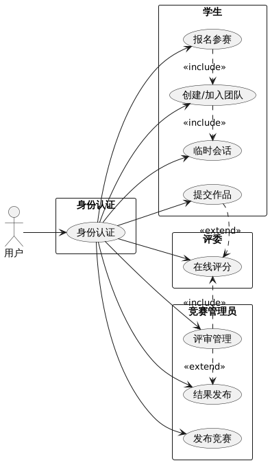
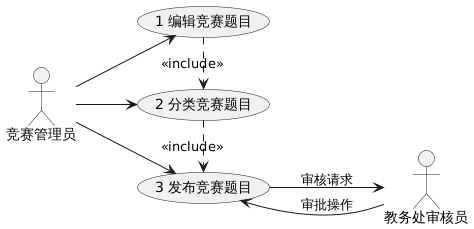
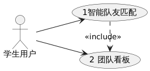
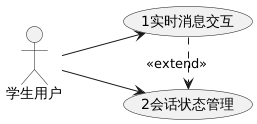

# **学科竞赛管理系统需求规格说明书**

## **1. 引言**

### 1.1 项目背景

  当前高校学科竞赛活动蓬勃发展，但传统的人工管理模式已严重制约其发展效率：报名信息分散在微信、QQ、邮件和纸质表格等多种渠道，导致信息核对效率低下；跨专业组队缺乏有效对接平台；评审过程依赖纸质材料传递，评分统计错误率较高；更严重的是，大量的获奖作品赛后未能有效保存，造成优质学术资源的严重流失。为此，需建立一套全流程数字化管理系统，通过智能化的题目发布、精准组队匹配、在线评审和成果归档等功能，改变当前低效的管理模式。

### 1.2 文档目的

  编写本文档的目的是根据系统分析工程师和客户沟通的结果，对用户需求进行了全面细致的分析，深入描述学科竞赛管理系统的功能和性能与界面，确定该软件设计的限制和定义软件的其他有效性需求。

## **2. 功能性需求**

### 2.1 系统角色

| 角色       | 描述                         |
| ---------- | ---------------------------- |
| 系统管理员 | 负责基础数据管理（增删改查） |
| 竞赛管理员 | 负责竞赛全部流程管理         |
| 评委       | 负责参赛作品的评审           |
| 学生用户   | 参赛者                       |
| 游客       | 未登录用户，只可浏览公开信息 |

### 2.2 核心用例图

### 2.3 详细功能需求

#### 2.3.1 题目发布管理

- **富文本编辑：**支持图文混排、视频嵌入、附件上传。

  - #### 用例1：富文本编辑竞赛题目

    | **项目**       | **描述**                                                     |
    | -------------- | ------------------------------------------------------------ |
    | **用例名称**   | 1编辑竞赛题目                                                |
    | **参与者**     | 竞赛管理员                                                   |
    | **前置条件**   | 1. 管理员已登录系统 2. 拥有"题目管理"权限               |
    | **后置条件**   | 竞赛题目保存成功并进入审核队列                               |
    | **基本事件流** | 1. 管理员进入"发布竞赛"界面 2. 选择"新建竞赛题目" 3. 在富文本编辑器中输入题目内容 4. 插入示意图图片（PNG格式） 5. 嵌入讲解视频（MP4格式） 6. 上传参考文档附件（PDF格式） 7. 点击"保存草稿"按钮  |

- **竞赛分类：**按学科/级别/时间分类。

  - #### 用例2：设置竞赛分类

    | **项目**       | **描述**                                                     |
    | -------------- | ------------------------------------------------------------ |
    | **用例名称**   | 2分类竞赛题目                                                |
    | **参与者**     | 竞赛管理员                                                   |
    | **前置条件**   | 1已完成                                                      |
    | **后置条件**   | 题目按分类体系入库                                           |
    | **基本事件流** | 1. 在编辑页面选择"分类设置" 2. 选择一级学科分类 3. 选择二级级别分类 4. 设置三级时间分类 5. 添加自定义标签 6. 确认分类信息  |

- **权限控制：**分级发布机制。

  - #### 用例3：分级发布题目

    | **项目**       | **描述**                                                     |
    | -------------- | ------------------------------------------------------------ |
    | **用例名称**   | 3发布竞赛题目                                                |
    | **参与者**     | 竞赛管理员、教务处审核员                                     |
    | **前置条件**   | 2已完成                                                      |
    | **后置条件**   | 题目进入指定发布状态                                         |
    | **基本事件流** | 1. 选择"发布审批"操作 2. 根据权限选择发布级别：  a) 院级：直接发布  b) 校级：提交教务处审核 3. 填写发布说明 4. 确认发布  |

- **用例关系图**

#### 2.3.2 学生组队报名

- **智能匹配：**基于标签的队友推荐

  - #### 用例1：智能匹配队友

    | **项目**       | **描述**                                                     |
    | -------------- | ------------------------------------------------------------ |
    | **用例名称**   | 1智能队友匹配                                                |
    | **参与者**     | 学生用户                                                     |
    | **前置条件**   | 1. 学生已报名竞赛 2. 个人资料完整度≥80%                 |
    | **后置条件**   | 生成匹配度报告                                               |
    | **基本事件流** | 1. 进入"组队大厅"界面 2. 点击"智能匹配"按钮 3. 系统分析 4. 显示推荐队友 5. 查看详细匹配分析报告  |

- **团队看板：**可视化展示成员构成

  - #### 用例2：团队看板管理

    | **项目**       | **描述**                                       |
    | -------------- | ---------------------------------------------- |
    | **用例名称**   | 2团队可视化看板                                |
    | **参与者**     | 团队成员                                       |
    | **前置条件**   | 已加入/创建团队                                |
    | **后置条件**   | 实时更新团队状态                               |
    | **基本事件流** | 1. 进入团队详情页 2. 查看可视化元素  |

- **用例关系图**：

#### 2.3.3 临时会话系统

- **即时通讯：**支持文字/图片/文件传输

  - #### 用例1：即时通讯交互

    | **项目**       | **描述**                                                     |
    | -------------- | ------------------------------------------------------------ |
    | **用例名称**   | 1实时消息交互                                                |
    | **参与者**     | 学生用户                                                     |
    | **前置条件**   | 1. 已加入竞赛团队 2. 会话窗口已开启                     |
    | **后置条件**   | 消息送达接收方                                               |
    | **基本事件流** | 1. 在会话输入框输入文字 2. 点击"发送"按钮 3. 系统自动加密消息 4. 通过WebSocket实时推送 5. 接收方显示新消息通知  |

- **会话管理：**创建管理会话

  - #### 用例2：会话生命周期管理

    | **项目**       | **描述**                                                     |
    | -------------- | ------------------------------------------------------------ |
    | **用例名称**   | 2会话状态管理                                                |
    | **参与者**     | 学生用户                                                     |
    | **前置条件**   | 存在活跃会话                                                 |
    | **后置条件**   | 会话状态变更                                                 |
    | **基本事件流** | 1. 在会话列表选择目标会话 2. 执行状态操作 3. 确认操作结果  |

- **用例关系图：**

#### 2.3.4 作品提交

- **多格式支持：**接受文档/代码/视频等

  - #### 用例：多格式作品提交

    | **项目**       | **描述**                                                     |
    | -------------- | ------------------------------------------------------------ |
    | **用例名称**   | 多格式作品上传                                               |
    | **参与者**     | 成员                                                         |
    | **前置条件**   | 1. 团队已通过报名审核 2. 竞赛处于作品提交期        |
    | **后置条件**   | 作品进入评审队列 团队状态更新为"已提交"            |
    | **基本事件流** | 1. 进入团队工作台选择"提交作品" 2. 选择提交类型 3. 拖拽或选择文件上传 4. 确认提交信息  |

#### 2.3.5 评审功能

- 评分模板：可定制评分表

  - #### 用例：定制评审评分表

    | **项目**       | **描述**                                                     |
    | -------------- | ------------------------------------------------------------ |
    | **用例名称**   | 定制评分模板                                                 |
    | **参与者**     | 竞赛管理员、评委                                             |
    | **前置条件**   | 1. 竞赛已进入评审准备阶段 2. 用户具有"评审管理"权限  |
    | **后置条件**   | 生成评分模板                                                 |
    | **基本事件流** | 1. 进入"评审管理"→"评分模板" 2. 编辑评分模版 3. 保存模板  |

#### 2.3.6 结果发布

- **多维度展示：**按奖项/学科/年份展示

  - #### 用例：竞赛结果的多维度展示

    | **项目**       | **描述**                                                     |
    | -------------- | ------------------------------------------------------------ |
    | **用例名称**   | 多维结果展示                                                 |
    | **参与者**     | 学生用户、教师、公众                                         |
    | **前置条件**   | 1. 竞赛评审已完成 2. 结果已通过最终审核 3. 结果发布状态设置为"公开"  |
    | **后置条件**   | 用户获取目标维度的结果视图                                   |
    | **基本事件流** | 1. 进入"竞赛结果"展示页 2. 选择展示维度 3. 查看数据  |

## 3. 非功能性需求

### 3.1 性能需求

| 指标     | 要求                 |
| -------- | -------------------- |
| 响应时间 | 关键操作小于2秒      |
| 吞吐量   | 支持100+竞赛同时报名 |
| 数据容量 | 存储5年竞赛历史数据  |

### 3.2 安全性需求

| 类型     | 措施                               |
| -------- | ---------------------------------- |
| 数据加密 | AES-256加密敏感数据                |
| 访问控制 | RBAC（基于角色的访问控制）权限模型 |
| 防攻击   | 防SQL注入/XSS                      |

### 3.3 可靠性需求

| 指标     | 要求                                                   |
| -------- | ------------------------------------------------------ |
| 可用性   | 99.9% SLA（服务级别协议：正常运行时间）                |
| 数据恢复 | RPO（数据恢复点目标，业务所能容忍的数据丢失量）≤15分钟 |
| 监控报警 | 关键指标实时监控                                       |

### 3.4 可用性需求

| 方面   | 标准                                            |
| ------ | ----------------------------------------------- |
| 兼容性 | 支持Chrome/Edge                                 |
| 无障碍 | WCAG(Web Content Accessibility Guidelines)  2.1 |

### 3.5 可维护性需求

| 要求   | 实施方式        |
| ------ | --------------- |
| 模块化 | 微服务架构      |
| 文档   | Swagger API文档 |
| 部署   | Docker          |

## 4. 数据模型

### 4.1 核心实体关系图

### 4.2 关键业务规则

1. **报名时间控制**：竞赛开始前7天截止报名
2. **组队人数限制**：根据竞赛类型动态调整（3-5人）
3. **评审权重计算**：加权平均（去掉最高最低分）
4. **作品提交时效**：截止时间后1小时内可补交（扣10%分数）

## 5. 接口需求

| 接口类型 | 标准 |
| -------- | ---- |
| 身份认证 |      |
| 文件传输 |      |
| 实时通讯 |      |
| 数据交换 |      |
