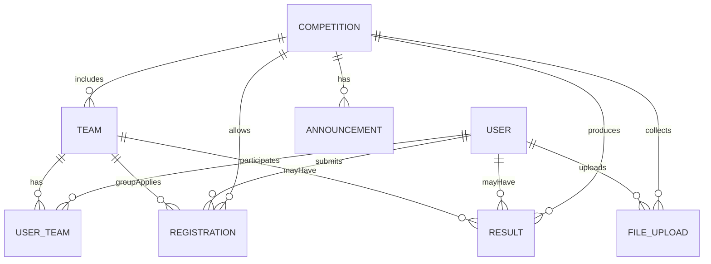
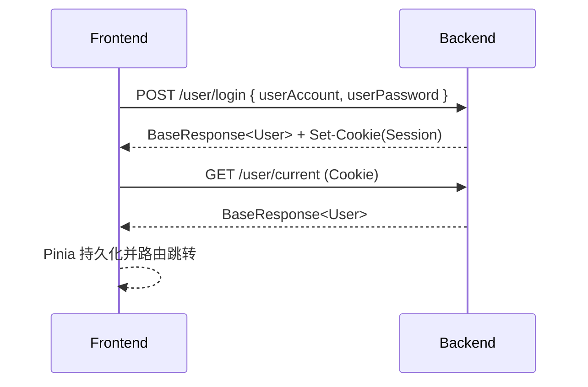
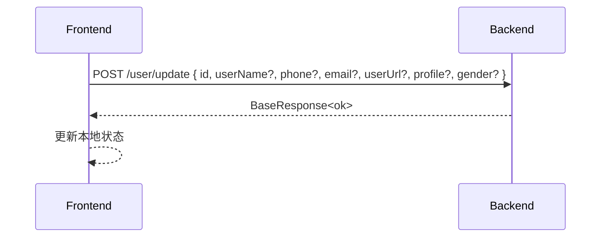
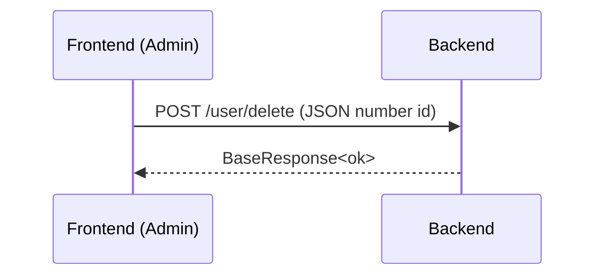

# 学科竞赛管理系统 - 设计文档

> 本文面向开发与评审，覆盖系统架构、模块划分、技术选型、数据库 ER、关键流程、接口签名与设计原则。后端实现以仓库 `Reviahh/GoblinCave-CMS-backend` 为准；本文已按提供的 SQL 初稿对齐。

## 1. 系统架构与技术选型

- 前端：
  - Vue 3 + Vite + Pinia + Vue Router + Element Plus
  - Axios withCredentials=true；开发环境使用 Vite 代理，确保同域 Cookie 传递
- 后端：
  - Spring Boot + MyBatis-Plus
  - 分层：Controller / Service / Mapper / Domain（Entity, DTO, VO）
  - 统一响应：`BaseResponse<T>`（code/data/message）
  - 会话认证：Session + Cookie（JSESSIONID）；40100 未登录，40101 无权限
- 数据库：
  - MySQL（字符集 utf8mb4，collation utf8mb4_general_ci）
  - 表结构见第 3 节
- 中间件（可选）：
  - Redis（会话/验证码/排行等）
  - 对象存储（头像、附件）
- 部署拓扑（建议）：
  - Nginx：前端静态资源托管 + 反向代理后端
  - Spring Boot：应用服务
  - MySQL、Redis

## 2. 模块划分与组件通信

- 用户模块（User）：
  - 账号（学号/工号）+ 密码登录；角色（0=学生，1=管理员）
  - 个人中心：账号只读；昵称、性别、手机号、邮箱、头像、简介可编辑
  - 管理端：查询、编辑、删除
  - 前端与后端通过 JSON over HTTP 通信；详见 `docs/apis/user.md`
- 竞赛模块（Competition）：
  - 管理竞赛的创建、编辑、发布、公告等
- 队伍模块（Team）：
  - 团队赛队伍创建、加入、成员管理
- 报名模块（Registration）：
  - 个人赛或团队赛的报名、审核
- 成绩模块（Result）：
  - 成绩录入、名次与奖项
- 文件上传（FileUpload）：
  - 作品/报告上传，关联竞赛与用户/队伍

> 前端模块：视图（views）、状态（stores）、接口层（src/api）、路由（router）。

## 3. 数据库表设计（ER 摘要）

根据提供 SQL（数据库 cms），核心表：

- user（用户表）
  - id (PK), userName, userAccount (unique), userPassword, userUrl, gender (0-女/1-男), phone, email, tags, userRole (0/1), profile, createTime, updateTime, isDelete
- competition（竞赛表）
  - id (PK), compName, category, organizer, description, startTime, endTime, isTeam, maxTeamSize, createUserId, createTime, updateTime, isDelete
- team（队伍表）
  - id (PK), compId (FK), name, description, maxNum, expireTime, userId(队长), status(0公开/1私有/2加密), password, createTime, updateTime, isDelete
- user_team（用户-队伍关系表）
  - id (PK), userId (FK), teamId (FK), joinTime, createTime, updateTime, isDelete
- registration（报名表）
  - id (PK), compId (FK), userId, teamId, status(0待审/1通过/2驳回), reviewUserId, submitTime, reviewTime, createTime, updateTime, isDelete
- result（成绩表）
  - id (PK), compId (FK), userId, teamId, score, rankNum, award, recordUserId, createTime, updateTime, isDelete
- announcement（公告表）
  - id (PK), compId (FK), title, content, userId, createTime, updateTime, isDelete
- file_upload（文件上传表）
  - id (PK), compId (FK), userId (FK), teamId, filePath, fileType, createTime, updateTime, isDelete

### ER 关系（Mermaid）



## 4. 接口定义（概览）

统一响应：
```json
{ "code": 0, "data": {}, "message": "ok" }
```

### 用户模块（具体见 docs/apis/user.md）
- POST /user/register
- POST /user/login
- POST /user/logout
- GET /user/current
- GET /user/search?userName=xxx
- POST /user/update
- POST /user/delete（JSON number）

### 竞赛模块（草案，详见下列 API 骨架）
- GET /competition/list?pageNum=&pageSize=&keyword=
- GET /competition/:id
- POST /competition/create（管理员）
- POST /competition/update（管理员）
- POST /competition/delete（管理员，JSON number）
- GET /announcement/list?compId=
- POST /announcement/create（管理员）

### 队伍模块（草案）
- GET /team/list?compId=
- POST /team/create（队长）
- POST /team/join
- POST /team/leave
- POST /team/update（队长/管理员）

### 报名与成绩（草案）
- POST /registration/apply（个人/团队）
- GET /registration/list?compId=
- POST /registration/review（管理员）
- POST /result/record（管理员/教师）
- GET /result/list?compId=

## 5. 关键流程（Mermaid 顺序图）

### 登录流程


### 个人资料更新


### 管理员删除用户


## 6. 设计原则与决策

- 可扩展性：
  - 更新接口采用“部分字段更新”；前端仅提交变更字段，降低并发覆盖风险
  - 统一分页参数（pageNum/pageSize）与列表返回结构，便于前后端共用组件
- 安全性：
  - Session + Cookie；开发同域代理避免跨站 Cookie 丢失
  - 40100 未登录自动跳转登录；40101 无权限按需提示
  - 管理员/本人权限边界清晰；后端服务层兜底校验
- 可观测性：
  - 统一错误码与 message 描述，便于前端直观展示
  - 建议接入请求日志/慢查询/错误跟踪