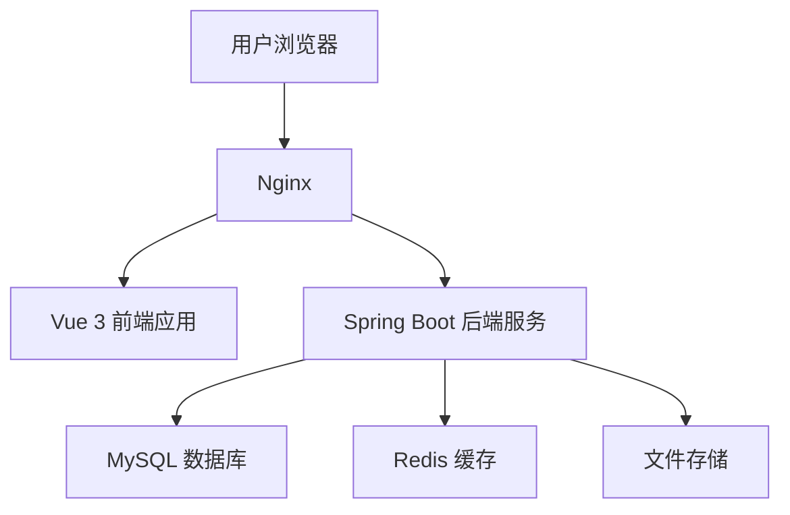
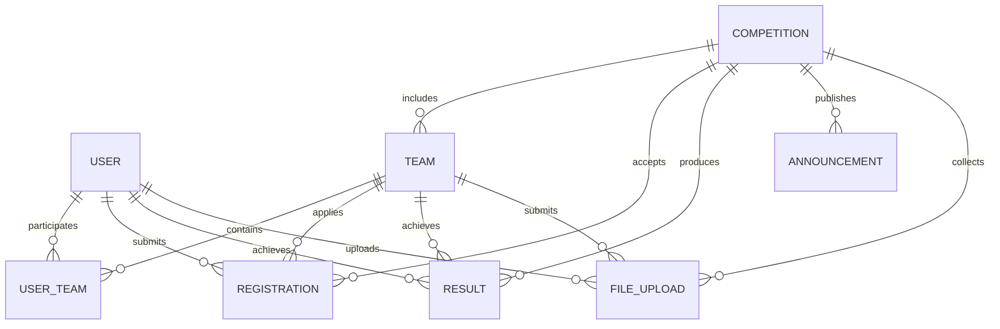
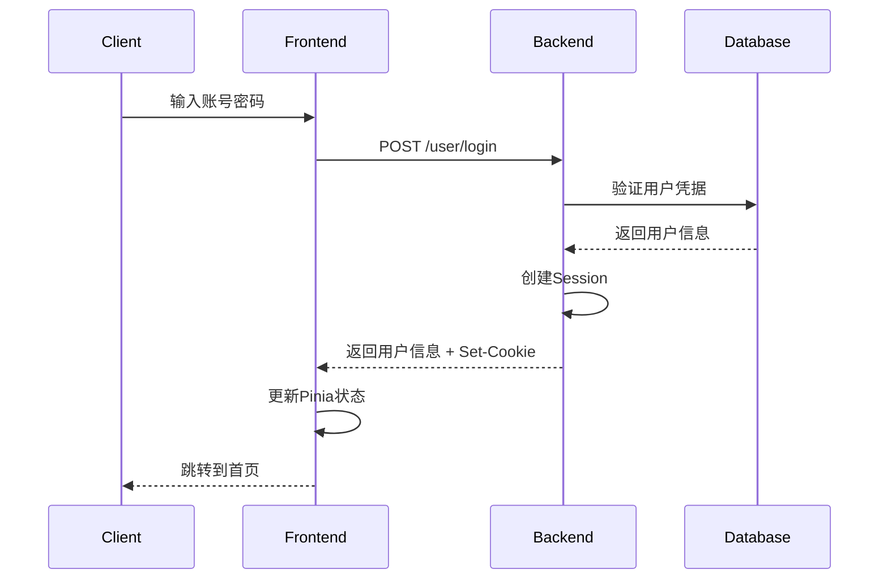
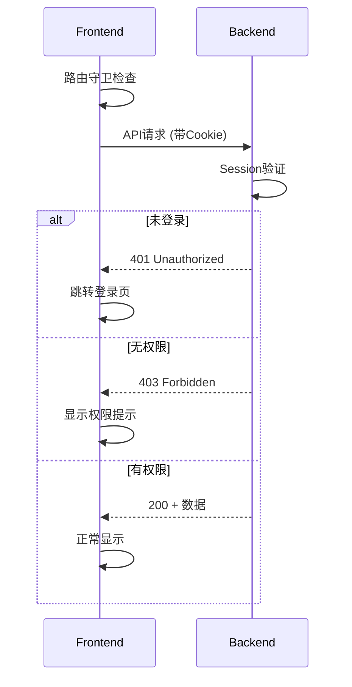
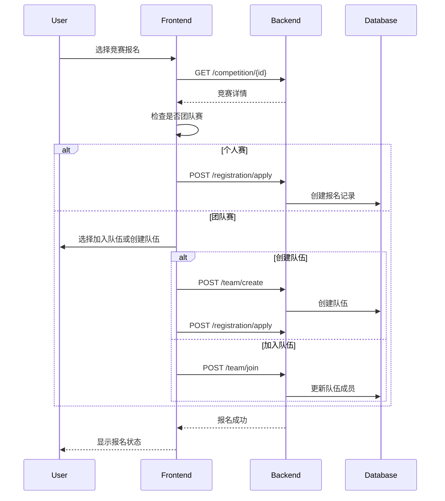

# 完整设计文档

## 1. 系统整体架构

### 1.1 架构风格
采用前后端分离的三层架构：
- **表示层**：Vue 3 SPA 应用
- **业务逻辑层**：Spring Boot REST API 服务
- **数据访问层**：MySQL + MyBatis-Plus

### 1.2 技术选型

#### 前端技术栈
- **框架核心**：Vue 3 (Composition API) + Vite (构建工具)
- **状态管理**：Pinia + pinia-plugin-persistedstate (持久化)
- **路由管理**：Vue Router (SPA 路由 + 导航守卫)
- **UI 组件库**：Element Plus
- **HTTP 客户端**：Axios (withCredentials=true)
- **富文本编辑**：@vueup/vue-quill

#### 后端技术栈
- **框架**：Spring Boot + Spring MVC
- **数据持久化**：MyBatis-Plus + MySQL
- **依赖注入**：Spring IOC
- **会话管理**：Spring Session (基于 Cookie)
- **数据验证**：Hibernate Validator

#### 中间件与工具
- **数据库**：MySQL 8.0+ (utf8mb4)
- **缓存** (可选)：Redis (会话存储、验证码)
- **文件存储** (可选)：本地文件系统或对象存储
- **部署**：Nginx (静态资源) + Spring Boot (JAR)

### 1.3 部署拓扑



## 2. 前端架构设计

### 2.1 目录结构与模块划分

```
src/
├── main.js              # 应用入口，插件注册
├── App.vue              # 根组件
├── api/                 # API 接口层
│   ├── http.js          # Axios 配置与拦截器
│   └── user.js          # 用户相关 API
├── stores/              # Pinia 状态管理
│   ├── user.js          # 用户状态
│   ├── competition.js   # 竞赛状态
│   ├── team.js          # 队伍状态
│   └── chat.js          # 聊天状态
├── router/              # 路由配置
│   └── index.js         # 路由定义与守卫
├── views/               # 页面组件
├── components/          # 可复用组件
├── layout/              # 布局组件
└── assets/              # 静态资源
```

### 2.2 核心组件设计

#### 2.2.1 主布局组件 (MainLayout.vue)
```vue
<template>
  <div class="layout">
    <HeaderBar />
    <div class="content-wrapper">
      <SideMenu v-if="showSidebar" />
      <main class="main-content">
        <BreadcrumbBar />
        <router-view />
      </main>
    </div>
    <FooterBar />
  </div>
</template>
```

#### 2.2.2 路由守卫机制
```javascript
router.beforeEach(async (to, from, next) => {
  const userStore = useUserStore()
  
  // 会话检查
  if (!sessionChecked) {
    sessionChecked = true
    await userStore.fetchCurrentUser()
  }
  
  // 认证拦截
  if (to.meta.requiresAuth && !userStore.isLoggedIn) {
    return next('/login')
  }
  
  // 角色权限拦截
  if (to.meta.role && userStore.role !== to.meta.role) {
    return next('/')
  }
  
  next()
})
```

### 2.3 状态管理架构

#### 2.3.1 用户状态 (stores/user.js)
```javascript
export const useUserStore = defineStore('user', {
  state: () => ({
    currentUser: null,
    isLoggedIn: false,
    role: null // 'admin' | 'student'
  }),
  
  actions: {
    async login(credentials) {
      const response = await apiLogin(credentials)
      this.setUser(response.data)
    },
    
    async fetchCurrentUser() {
      const response = await apiGetCurrentUser()
      this.setUser(response.data)
    }
  }
}, {
  persist: true // 本地存储持久化
})
```

### 2.4 HTTP 客户端配置

详见 [src/api/http.js](src/api/http.js#L1-L51)：
- **跨域处理**：`withCredentials: true` 确保 Cookie 传递
- **请求拦截**：自动添加 Authorization header
- **响应拦截**：401 状态码自动跳转登录，错误消息规范化

## 3. 后端架构设计

### 3.1 目录结构与模块划分

```
├── BackendApplication.java          ├── common/                          # 共享工具和响应类
│   ├── BaseResponse.java           # 统一 API 响应包装器
│   ├── ErrorCode.java              # 错误码定义
│   └── ResultUtils.java            # 响应工具方法
├── constant/                       # 应用常量
│   └── UserConstant.java           # 用户相关常量
├── controller/                     # REST API 端点
│   ├── CompetitionController.java  # 竞赛管理 API
│   └── UserController.java         # 用户管理 API
├── exception/                      # 异常处理
│   ├── BusinessException.java     # 自定义业务异常
│   └── GlobalExceptionHandler.java # 全局错误处理
├── mapper/                         # 数据访问层
│   ├── CompetitionMapper.java      # 竞赛数据操作
│   └── UserMapper.java             # 用户数据操作
├── model/                          # 数据模型
│   ├── domain/                     # 实体类
│   └── request/                    # 请求的 DTO 类
└── service/                        # 业务逻辑层
    ├── CompetitionService.java     # 竞赛业务逻辑
    ├── UserService.java            # 用户业务逻辑
    └── impl/                       # 服务实现
```

### 3.2 关键架构模式

1. #### 分层架构模式

  系统实现了严格的层分离：

控制器层：处理 HTTP 请求和响应 来源
服务层：包含业务逻辑和验证 来源
映射器层：使用 MyBatis-Plus 管理数据库操作

2. #### 依赖注入模式

  Spring Boot 的 IoC 容器管理所有组件依赖：

服务通过 @Resource 注解注入到控制器中
映射器通过 @MapperScan 自动配置 来源

3. #### 统一响应模式

  所有 API 端点返回标准化的响应格式 

```
{
  "code": 0,           // 状态码
  "data": {},          // 响应负载
  "message": "success", // 状态消息
  "description": ""     // 附加详情
}
```

## 4. 数据库设计

### 4.1 核心实体关系图



### 4.2 主要数据表设计

#### 4.2.1 用户表 (user)
```sql
CREATE TABLE user (
    id BIGINT PRIMARY KEY AUTO_INCREMENT,
    userName VARCHAR(256) NOT NULL COMMENT '用户昵称',
    userAccount VARCHAR(256) NOT NULL UNIQUE COMMENT '学号/工号',
    userPassword VARCHAR(512) NOT NULL COMMENT '密码',
    userUrl VARCHAR(1024) COMMENT '头像URL',
    gender TINYINT DEFAULT 0 COMMENT '性别 0-女 1-男',
    phone VARCHAR(128) COMMENT '电话',
    email VARCHAR(512) COMMENT '邮箱',
    tags VARCHAR(1024) COMMENT '标签JSON',
    userRole TINYINT DEFAULT 0 COMMENT '角色 0-学生 1-管理员',
    profile VARCHAR(512) COMMENT '个人简介',
    createTime DATETIME DEFAULT CURRENT_TIMESTAMP,
    updateTime DATETIME DEFAULT CURRENT_TIMESTAMP ON UPDATE CURRENT_TIMESTAMP,
    isDelete TINYINT DEFAULT 0
);
```

#### 4.2.2 竞赛表 (competition)
```sql
CREATE TABLE competition (
    id BIGINT PRIMARY KEY AUTO_INCREMENT,
    compName VARCHAR(256) NOT NULL COMMENT '竞赛名称',
    category VARCHAR(128) COMMENT '竞赛类别',
    organizer VARCHAR(256) COMMENT '主办方',
    description TEXT COMMENT '竞赛描述',
    startTime DATETIME COMMENT '开始时间',
    endTime DATETIME COMMENT '结束时间',
    isTeam TINYINT DEFAULT 0 COMMENT '是否团队赛',
    maxTeamSize INT DEFAULT 1 COMMENT '最大队伍人数',
    createUserId BIGINT COMMENT '创建者ID',
    createTime DATETIME DEFAULT CURRENT_TIMESTAMP,
    updateTime DATETIME DEFAULT CURRENT_TIMESTAMP ON UPDATE CURRENT_TIMESTAMP,
    isDelete TINYINT DEFAULT 0
);
```

## 5. API 接口设计

### 5.1 用户模块接口

#### 5.1.1 用户登录
```http
POST /user/login
Content-Type: application/json

{
    "userAccount": "string",
    "userPassword": "string"
}
```

**响应**:
```json
{
    "code": 0,
    "data": {
        "id": 1,
        "userName": "张三",
        "userAccount": "2023001",
        "userRole": 0
    },
    "message": "ok"
}
```

#### 5.1.2 获取当前用户
```http
GET /user/current
Cookie: JSESSIONID=xxx
```

#### 5.1.3 更新用户信息
```http
POST /user/update
Content-Type: application/json

{
    "id": 1,
    "userName": "新昵称",
    "phone": "13800138000",
    "email": "user@example.com"
}
```

### 5.2 竞赛模块接口

#### 5.2.1 竞赛列表查询
```http
GET /competition/list?pageNum=1&pageSize=10&keyword=编程
```

#### 5.2.2 竞赛详情
```http
GET /competition/{id}
```

#### 5.2.3 创建竞赛 (管理员)
```http
POST /competition/create
Content-Type: application/json

{
    "compName": "程序设计竞赛",
    "category": "编程类",
    "organizer": "计算机学院",
    "description": "竞赛描述",
    "startTime": "2024-03-01T09:00:00",
    "endTime": "2024-03-01T17:00:00",
    "isTeam": 1,
    "maxTeamSize": 3
}
```

### 5.3 队伍模块接口

#### 5.3.1 队伍列表
```http
GET /team/list?compId=1&pageNum=1&pageSize=10
```

#### 5.3.2 创建队伍
```http
POST /team/create
Content-Type: application/json

{
    "compId": 1,
    "name": "代码勇士队",
    "description": "队伍描述",
    "maxNum": 3,
    "expireTime": "2024-03-01T00:00:00",
    "status": 0,
    "password": "123456"
}
```

## 6. 关键业务流程

### 6.1 用户认证流程



### 6.2 权限验证流程



### 6.3 竞赛报名流程



## 7. 核心算法与数据结构

### 7.1 分页查询算法

```java
public class PageHelper {
    public static <T> PageResult<T> paginate(
            List<T> allData, 
            int pageNum, 
            int pageSize) {
        
        int total = allData.size();
        int totalPages = (int) Math.ceil((double) total / pageSize);
        int startIndex = (pageNum - 1) * pageSize;
        int endIndex = Math.min(startIndex + pageSize, total);
        
        List<T> pageData = allData.subList(startIndex, endIndex);
        
        return new PageResult<>(pageData, pageNum, pageSize, total, totalPages);
    }
}
```

### 7.2 队伍匹配算法

```java
public class TeamMatchingService {
    /**
     * 基于标签相似度的队伍推荐
     */
    public List<Team> recommendTeams(User user, Long compId) {
        List<Team> availableTeams = teamMapper.selectAvailableTeams(compId);
        Set<String> userTags = parseUserTags(user.getTags());
        
        return availableTeams.stream()
            .filter(team -> team.getCurrentSize() < team.getMaxNum())
            .map(team -> {
                double similarity = calculateTagSimilarity(userTags, getTeamTags(team));
                return new TeamSimilarity(team, similarity);
            })
            .sorted((a, b) -> Double.compare(b.similarity, a.similarity))
            .limit(10)
            .map(ts -> ts.team)
            .collect(Collectors.toList());
    }
    
    private double calculateTagSimilarity(Set<String> tags1, Set<String> tags2) {
        Set<String> intersection = new HashSet<>(tags1);
        intersection.retainAll(tags2);
        
        Set<String> union = new HashSet<>(tags1);
        union.addAll(tags2);
        
        return union.isEmpty() ? 0.0 : (double) intersection.size() / union.size();
    }
}
```

### 7.3 成绩排序算法

```java
public class RankingService {
    /**
     * 计算竞赛排名
     */
    public void calculateRanking(Long compId) {
        List<Result> results = resultMapper.selectByCompId(compId);
        
        // 按分数降序排序
        results.sort((a, b) -> Double.compare(b.getScore(), a.getScore()));
        
        int currentRank = 1;
        double lastScore = Double.MAX_VALUE;
        int sameScoreCount = 0;
        
        for (int i = 0; i < results.size(); i++) {
            Result result = results.get(i);
            double currentScore = result.getScore();
            
            if (currentScore < lastScore) {
                currentRank = i + 1;
                sameScoreCount = 0;
            } else {
                sameScoreCount++;
            }
            
            result.setRankNum(currentRank);
            result.setAward(determineAward(currentRank, results.size()));
            
            lastScore = currentScore;
        }
        
        // 批量更新
        resultMapper.batchUpdate(results);
    }
}
```

## 8. 安全性设计

### 8.1 认证安全

1. **会话管理**：使用 Spring Session，自动处理会话超时
2. **密码安全**：BCrypt 加密存储，禁止明文传输
3. **跨域保护**：CORS 配置限制来源域

### 8.2 授权控制

```java
@PreAuthorize("hasRole('ADMIN') or @userService.isOwner(#userId, authentication.name)")
public BaseResponse updateUser(Long userId, UpdateUserRequest request) {
    // 业务逻辑
}
```

### 8.3 输入验证

```java
public class CreateCompetitionRequest {
    @NotBlank(message = "竞赛名称不能为空")
    @Length(max = 256, message = "竞赛名称长度不能超过256字符")
    private String compName;
    
    @Future(message = "开始时间必须是未来时间")
    private LocalDateTime startTime;
    
    @Valid
    private List<@NotNull CompetitionRule> rules;
}
```

## 9. 性能优化策略

### 9.1 前端优化

1. **路由懒加载**：[router/index.js](src/router/index.js#L18-L29) 使用动态 import
2. **组件缓存**：合理使用 `<keep-alive>`
3. **状态持久化**：Pinia + localStorage 减少重复请求

### 9.2 后端优化

1. **数据库索引**：在 userAccount、compId 等字段建立索引
2. **查询优化**：使用 MyBatis-Plus 分页插件
3. **缓存策略**：热点数据使用 Redis 缓存

### 9.3 网络优化

1. **静态资源**：Nginx 压缩与缓存
2. **API 设计**：减少请求次数，合并相关数据
3. **图片优化**：头像等图片使用 CDN

## 10. 可扩展性设计

### 10.1 模块化架构

每个业务模块独立开发，通过事件总线或消息队列解耦：

```java
@Component
public class CompetitionEventListener {
    @EventListener
    public void handleCompetitionCreated(CompetitionCreatedEvent event) {
        // 发送通知
        notificationService.notifyUsers(event.getCompetition());
    }
}
```

### 10.2 插件化支持

竞赛类型可通过策略模式扩展：

```java
public interface CompetitionStrategy {
    void validateRules(Competition competition);
    void calculateScore(Result result);
    void determineWinners(List<Result> results);
}

@Component
public class ProgrammingCompetitionStrategy implements CompetitionStrategy {
    // 编程竞赛特定逻辑
}
```

## 11. 错误处理与监控

### 11.1 统一异常处理

```java
@ControllerAdvice
public class GlobalExceptionHandler {
    @ExceptionHandler(BusinessException.class)
    public BaseResponse handleBusinessException(BusinessException e) {
        return BaseResponse.error(e.getErrorCode());
    }
    
    @ExceptionHandler(ValidationException.class)
    public BaseResponse handleValidationException(ValidationException e) {
        return BaseResponse.error(ErrorCode.PARAMS_ERROR, e.getMessage());
    }
}
```

### 11.2 日志记录

```java
@Aspect
@Component
public class ApiLogAspect {
    @Around("@annotation(ApiLog)")
    public Object logApi(ProceedingJoinPoint point) throws Throwable {
        long startTime = System.currentTimeMillis();
        try {
            Object result = point.proceed();
            long duration = System.currentTimeMillis() - startTime;
            log.info("API {} executed in {}ms", point.getSignature(), duration);
            return result;
        } catch (Exception e) {
            log.error("API {} failed", point.getSignature(), e);
            throw e;
        }
    }
}
```
